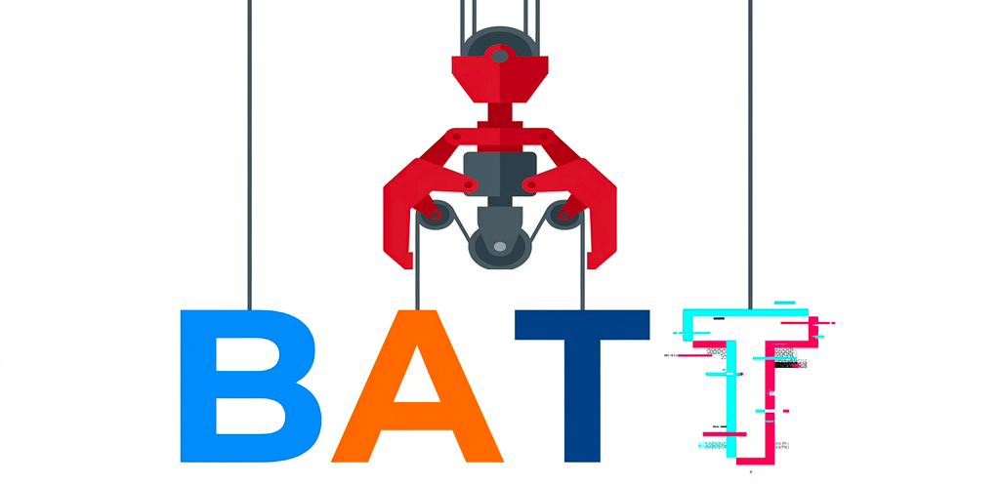
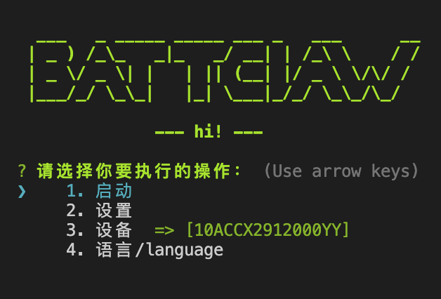

# BATTCLAW - MCP Auto Android Agent 人工智能手机助理

[English Version](./README_en.md)

[]()
[](https://opensource.org/licenses/Apache-2.0)
[](https://www.typescriptlang.org/)
[](https://modelcontextprotocol.io/)
[]()
[]()
[]()
[]()


> **打破生态壁垒，重塑数字自由。技术应服务于人的效率，而非服务平台的日活。**

# 简介
<p align="center">
    
</p>

<br>

作为一款诞生于 “打通生态闭环、践行技术反垄断” 愿景的开源 AI Agent，**BATTClaw** 始终坚持 **隐私安全** 与 **完全免费** 的核心理念。它不仅支持**灵活切换任意主流多模态大模型**（云端/本地），更深度支持 **全流程本地化部署**，确保敏感数据永不离端。通过完美兼容 **OpenCode**、**ClaudeCode**、**OpenClaw (小龙虾)** 等 MCP 协议环境，它能让 **“家中闲置的旧安卓手机” 变废为宝**，化身为 24 小时待命的 AI 任务中枢，赋予 AI 深度跨平台协同与自动化执行能力，是用户在移动互联网时代夺回数字主动权的有力手段。
<br>


## 演示视频 (Demo)


#### 演示环境配置：
*   **测试设备**：vivo Y35m (入门级设备)
*   **AI 模型**：Gemini 3 Flash Lite 
*   **连接方式**：USB调试 / 无线调试
*   **核心演示内容**：展示了 BATTClaw 处理跨应用、长链路复杂任务的实战能力：
    1.  **机票预订与通知**：*“帮我找 4月5日 北京到上海 最便宜的机票，并把结果发短信给 18888888888”*
    2.  **外卖自动化操作**：*“在美团上点老乡鸡的‘鸡杂’和‘小炒肉’外卖，并跳转到待付款页面”*
    3.  **信息检索与跨端分享**：*“查找后天中午 12 点左右北京到香港的机票，并微信发给唐臣轩”*

<!-- <video src="../tmp/4月18日.mov" controls width="100%" ></video> -->
<video src="https://github.com/user-attachments/assets/e2aa297b-3896-44a2-a2d5-7acbe0eee2ec" controls width="100%"></video>

## 核心特性

**BATTClaw (Phone Agent)** 是一款通用的、高度开放的手机端智能助理框架。它旨在打破模型壁垒，**支持自定义接入市面上所有主流的多模态大模型**，并允许用户通过自动化操作高效完成任务：

*   **全模型兼容性**：支持云端主流模型如 Gemini, MiniMax , Kimi , Claude 等。
*   **极致隐私方案**：系统深度支持**接入本地大模型**。所有屏幕感知、意图解析与决策流程均可在本地端到端完成，数据不上传云端。
*   **灵活的远程控制**：除了标准的 ADB 物理连接，系统还提供**远程 ADB 调试**能力（通过 WiFi 或网络连接连接设备），实现跨空间的灵活操控与开发。
*   **设备矩阵方案**：支持安卓虚拟机设备矩阵，多开与并行任务执行能力。即将上线，目前该方案正在调试中

# 快速开始三部曲

### 1. 环境检查与配置
在开始之前，请确保你的开发环境已准备就绪：

#### 1.1 Node.js 环境
*   建议使用 **Node.js v18** 及以上版本。

#### 1.2 手机调试工具 (ADB)
为了与 Android 设备通信，你需要安装 ADB 命令行工具：
*   **下载与安装**：[点击下载官方 ADB 安装包](https://developer.android.com/tools/releases/platform-tools)，下载后解压到自定义路径。
*   **配置环境变量 (macOS / Linux)**：
    在 Terminal 中执行以下命令（请根据实际解压路径进行调整）：
    ```bash
    # 假设解压后的目录为 ~/Downloads/platform-tools
    export PATH=${PATH}:~/Downloads/platform-tools
    ```

### 2. 开启手机 ADB 调试
请确保你的 Android 物理手机已开启 **“开发者选项”** 及 **“USB 调试”**：
*   **操作简述**：
    1.  打开手机 **"设置"** → **"关于手机"**。
    2.  连续点击 **"版本号"** 7 次，直到出现 **"您已进入开发者模式"** 提示。
    3.  返回 **"设置"** 主页，进入 **"开发者选项"**（部分机型在 "系统" 或 "其他设置" 中）。
    4.  开启 **"USB 调试"** 开关。
    5.  用数据线连接手机与电脑，手机弹出 **"允许 USB 调试？"** 时点击 **"允许"**。
*   **官方指引**：[官方开启指南](https://developer.android.com/studio/debug/dev-options?hl=zh-cn)
*   **验证连接**：在终端执行 `adb devices`，若能看到设备序列号则表示连接成功。
*   **无线调试**：不想用数据线？也可以通过 WiFi 无线连接手机 [无线 ADB 调试指南](./docs/adb/wirelessDebug_zh-cn.md)

### 3. 启动 BATTCLAW
进入 `server` 目录，安装依赖并启动：
```bash
npm install
npm run index
```

*   **首次连接引导**：
    *   启动后，系统会自动检查并尝试为手机安装 `ADB Keyboard` 插件。
    *   **注意**：部分机型（如小米、Vivo、OPPO 等）会弹出安装确认弹窗，请务必在手机上点击 **“允许/安装”**。
    *   安装成功后，系统将自动进入如下主菜单界面，看到该界面即表示连接成功 🎉：

<p align="center">
    
</p>

*   **绑定 API Key**：在主菜单选择 `设置 -> 模型配置`，根据提示绑定你的模型 API Key 并在 `设置 -> 选择模型` 选择已绑定 API 的模型后即可 `启动` 开始使用。

### 4. 调试与进阶配置 (Debug)
你可以通过修改 `.env` 文件中的开关来观察系统的深度运行状态：
*   **`SHOWTHINK=true`** (建议开启)：开启后，你可以在控制台实时看到 AI 在执行动作前的“思考过程”。它会分析当前的屏幕布局、识别障碍物并制定行动意图。
*   **`DEBUG=true`**：开启详细调试模式。系统会打印出与手机通信的所有底层 ADB 指令细节，适合在动作失效时定位物理层连接问题。

> [!TIP]
> **模型选择与免费指南**：
> *   **模型推荐**：强烈建议优先使用 **Gemini Flash** 系列（如 `gemini-3-flash-preview`、`gemini-3.1-flash-lite-preview`），该系列在移动端视觉感知与任务执行中的成功率最高，且响应速度更快。
> *   **如何免费使用**：访问 [Google AI Studio](https://aistudio.google.com/) 即可申请免费的 API Key。Gemini 提供极其慷慨的 **Free tier**（免费层级），完全满足个人日常自动化任务的需求。
---

## MCP 自动化运行 (高级)

BATTClaw 完美兼容 **MCP (Model Context Protocol)** 协议。你可以将其作为一个标准的 MCP 服务挂载到 **OpenCode**、**ClaudeCode** 或 **OpenClaw (小龙虾)** 等智能助手中，让 AI 拥有直接操控你手机的能力。

### 1. 挂载到智能助手 (推荐方案)
根据你使用的工具，将以下配置添加至对应的配置文件中：

#### **对于 OpenCode**
配置文件位置：`~/.opencode/opencode.json`
```json
"mcp": {
  "battclaw": {
    "enabled": true,
    "type": "local", 
    "command": ["/项目绝对路径/server/start-battclaw.sh"]
  }
}
```

#### **对于 Claude Code / Claude Desktop**
配置文件位置：`~/Library/Application Support/Claude/claude_desktop_config.json`
```json
"mcpServers": {
  "battclaw": {
    "command": "bash",
    "args": ["/项目绝对路径/server/start-battclaw.sh"]
  }
}
```

> **优点**：该脚本会自动处理运行路径并支持直接运行源码，无需手动 `npm run build`，最适合开发者使用。

### 2. OpenClaw (小龙虾) 挂载
支持通过 `openclaw-mcp-bridge` 插件进行深度集成，并可通过 `SKILL` 注入增强 AI 的安卓专家意识。

👉 **详细配置步骤请参考**：[OpenClaw 0-1 小龙虾快速安装指南](./docs/openclaw/openclawConfig_zh-cn.md)

---

## 常见问题 (FAQ)

| 问题 | 解决方法 |
|------|----------|
| 启动后一直显示"等待设备连接" | 确认手机已开启 USB 调试，数据线支持数据传输（非仅充电线），终端执行 `adb devices` 检查 |
| 手机上不弹出安装确认窗口 | 部分机型需要在 "开发者选项" 中手动开启 "允许通过 USB 安装应用" |
| 提示模型配置错误 | 进入 `设置 -> 模型配置` 检查 API Key 是否正确填写，并在 `选择模型` 中激活 |
| 执行任务时截图失败 | 确认手机屏幕未锁定，且未弹出系统级弹窗遮挡界面 |
| WiFi 无线连接不上 | 确认手机和电脑在同一网络，参考 [无线调试指南](./docs/adb/wirelessDebug_zh-cn.md) |

---

## 参与贡献

欢迎任何形式的贡献！无论是 Bug 反馈、功能建议还是代码 PR，都非常感谢。在开始贡献之前，建议先阅读：
*   [技术架构与设计思路](./docs/design/design.md) - 深入了解 BATTClaw 的多角色协同架构、提示词工程与项目结构。

1. Fork 本仓库
2. 创建你的分支 (`git checkout -b feature/amazing-feature`)
3. 提交更改 (`git commit -m 'feat: add amazing feature'`)
4. 推送分支 (`git push origin feature/amazing-feature`)
5. 发起 Pull Request

[]()

---

## 许可证

本项目基于 [Apache License 2.0](./LICENSE) 开源发布。

### 开源说明
我们秉承极客精神，给予开发者最大限度的自由：
- **极致自由**：您可以自由修改、集成、再分发代码，且**无需**强制开源您的衍生产品。
- **商业友好**：我们欢迎任何形式的商业探索。

### 商业支持与可持续发展
为了让本项目能够长期稳定迭代，我们提出了以下**君子协定**：
- **小微企业与个人**：年营收低于 **$100,000 USD** 的实体可永久免费使用。
- **大型企业**：如果您通过本项目获得了丰厚的收益，建议您联系作者获得**商业支持授权**。

#### 🕊️ 85公益承诺
我们秉持“科技向善”的理念，郑重承诺：
所有通过本项目的 **核心代码授权 (License Fee)** 及 **社区赞助 (Sponsorship)** 获得的资金，其 **85%** 将直接捐赠给 **UNICEF (联合国儿童基金会)**。
*注：作者提供的技术咨询、定制化开发、私有化部署等“劳务/服务性收益”不属于此类，归作者所有，用于维持项目长期研发。*

---

<a id="contact"></a>

## 联系我们 (Contact)

如果您对本项目感兴趣，或者有商业合作、功能定制的需求，欢迎通过以下方式取得联系：

*   **邮箱**: [tangcxxxxx@gmail.com]
*   **微信**: [TANGCXXXXX] (加好友请备注: BattClaw 合作)

> **"一个人可以走得很快，但一群人可以走得很远。"** 期待与各位极客共同探索手机 Agent 的未来！

---

## 致谢

本项目在开发过程中得到了众多开源项目的支持与启发，特别鸣谢 **Google Gemini** 团队、**adbkit** 社区以及 **MCP** 协议生态等。

完整的致谢名单与技术栈说明请查阅：[鸣谢名单 (Acknowledgements)](./ACKNOWLEDGEMENTS.md)