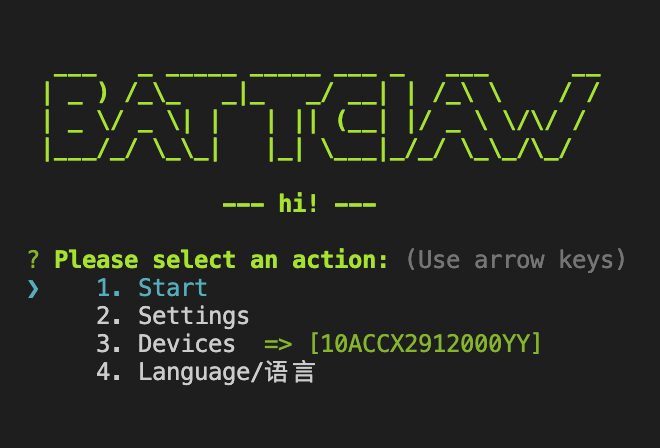

# BATTCLAW - MCP Auto Android Agent AI Mobile Assistant

[中文版本](./README.md) | *English document translated by AI*

[]()
[](https://opensource.org/licenses/Apache-2.0)
[](https://www.typescriptlang.org/)
[](https://modelcontextprotocol.io/)
[]()
[]()
[]()
[]()


> **Break down ecological barriers, reshape digital freedom. Technology should serve human efficiency, not platform DAU.**

# Introduction
<p align="center">
    
</p>

<br>

As an open-source AI Agent born from the vision of "opening up ecological loops and practicing technical anti-monopoly", **BATTClaw** always adheres to the core concepts of **privacy & security** and **completely free**. It not only supports **flexibly switching to any mainstream multi-modal large model** (cloud/local), but also deeply supports **full-process localized deployment**, ensuring that sensitive data never leaves the edge. By perfectly complementing MCP protocol environments like **OpenCode**, **ClaudeCode**, and **OpenClaw**, it can turn your **"idle old Android phone at home" into a treasure**, transforming it into a 24-hour AI task hub, giving AI deep cross-platform collaboration and automated execution capabilities. It is a powerful means for users to regain digital initiative in the mobile Internet era.
<br>


## Demo Video


#### Demo Environment Configuration:
*   **Test Device**: vivo Y35m (Entry-level device)
*   **AI Model**: Gemini 3 Flash Lite 
*   **Connection Method**: USB Debugging / Wireless Debugging
*   **Core Demo Content**: Demonstrates BATTClaw's practical ability to handle cross-app, long-chain complex tasks:
    1.  **Flight Booking and Notification**: *"Help me find the cheapest flight from Beijing to Shanghai on April 5th, and send the result via SMS to 18888888888"*
    2.  **Takeout Automation**: *"Order 'Chicken Giblets' and 'Stir-fried Pork' from Old Home Chicken on Meituan, and jump to the pending payment page"*
    3.  **Information Retrieval and Cross-device Sharing**: *"Find flights from Beijing to Hong Kong around 12 noon the day after tomorrow, and send them to Tang Chenxuan via WeChat"*

<!-- <video src="../tmp/April18.mov" controls width="100%" ></video> -->
<video src="https://github.com/user-attachments/assets/e2aa297b-3896-44a2-a2d5-7acbe0eee2ec" controls width="100%"></video>

## Core Features

**BATTClaw (Phone Agent)** is a universal, highly open mobile intelligent assistant framework. It aims to break model barriers, **supporting custom access to all mainstream multi-modal large models on the market**, and allows users to efficiently complete tasks through automated operations:

*   **Full Model Compatibility**: Supports mainstream cloud models such as Gemini, MiniMax, Kimi, Claude, etc.
*   **Ultimate Privacy Solution**: The system deeply supports **accessing local large models**. All screen perception, intent parsing, and decision-making processes can be completed end-to-end locally, without uploading data to the cloud.
*   **Flexible Remote Control**: In addition to standard physical ADB connections, the system also provides **remote ADB debugging** capabilities (connecting devices via WiFi or network), achieving flexible control and development across spaces.
*   **Device Matrix Solution**: Supports Android virtual machine device matrices, multi-opening, and parallel task execution capabilities. Coming soon, this solution is currently being debugged.

# Quick Start Trilogy

### 1. Environment Check and Configuration
Before you begin, make sure your development environment is ready:

#### 1.1 Node.js Environment
*   It is recommended to use **Node.js v18** and above.

#### 1.2 Phone Debugging Tool (ADB)
To communicate with Android devices, you need to install the ADB command-line tool:
*   **Download and Install**: [Click to download the official ADB installation package](https://developer.android.com/tools/releases/platform-tools), unzip it to a custom path after downloading.
*   **Configure Environment Variables (macOS / Linux)**:
    Execute the following command in the Terminal (please adjust according to the actual unzipped path):
    ```bash
    # Assuming the unzipped directory is ~/Downloads/platform-tools
    export PATH=${PATH}:~/Downloads/platform-tools
    ```

### 2. Enable Phone ADB Debugging
Please ensure your Android physical phone has **"Developer options"** and **"USB debugging"** enabled:
*   **Brief Operation**:
    1.  Open phone **"Settings"** → **"About phone"**.
    2.  Tap **"Build number"** 7 times continuously until you see the **"You are now a developer!"** prompt.
    3.  Return to the **"Settings"** main page, enter **"Developer options"** (on some models it's in "System" or "Additional settings").
    4.  Turn on the **"USB debugging"** switch.
    5.  Connect the phone and computer with a data cable, when the phone pops up **"Allow USB debugging?"**, tap **"Allow"**.
*   **Official Guide**: [Official Enable Guide](https://developer.android.com/studio/debug/dev-options?hl=en)
*   **Verify Connection**: Execute `adb devices` in the terminal, if you can see the device serial number, the connection is successful.
*   **Wireless Debugging**: Don't want to use a data cable? You can also connect the phone wirelessly via WiFi [Wireless ADB Debugging Guide](./docs/adb/wirelessDebug_en.md)

### 3. Start BATTCLAW
Enter the `server` directory, install dependencies and start:
```bash
npm install
npm run index
```

*   **First Connection Guide**:
    *   After starting, the system will automatically check and try to install the `ADB Keyboard` plugin for the phone.
    *   **Note**: Some models (such as Xiaomi, Vivo, OPPO, etc.) will pop up an installation confirmation window, please be sure to tap **"Allow/Install"** on the phone.
    *   After successful installation, the system will automatically enter the following main menu interface, seeing this interface means the connection is successful 🎉:

<p align="center">
    
</p>

*   **Bind API Key**: Select `Settings -> Model Configuration` in the main menu, follow the prompts to bind your model API Key, and after selecting the model bound with the API in `Settings -> Select Model`, you can `Start` to begin using.

### 4. Debugging and Advanced Configuration (Debug)
You can observe the deep running status of the system by modifying the switches in the `.env` file:
*   **`SHOWTHINK=true`** (Recommended to enable): After enabling, you can see the AI's "thinking process" in real-time in the console before executing an action. It will analyze the current screen layout, identify obstacles, and formulate action intents.
*   **`DEBUG=true`**: Enable detailed debugging mode. The system will print all underlying ADB command details communicating with the phone, suitable for locating physical layer connection issues when actions fail.

> [!TIP]
> **Model Selection and Free Guide**:
> *   **Model Recommendation**: It is strongly recommended to prioritize the **Gemini Flash** series (such as `gemini-3-flash-preview`, `gemini-3.1-flash-lite-preview`), this series has the highest success rate in mobile visual perception and task execution, and faster response speed.
> *   **How to Use for Free**: Visit [Google AI Studio](https://aistudio.google.com/) to apply for a free API Key. Gemini provides an extremely generous **Free tier**, fully meeting the needs of individual daily automated tasks.
---

## MCP Automated Running (Advanced)

BATTClaw perfectly complements the **MCP (Model Context Protocol)**. You can mount it as a standard MCP service into intelligent assistants like **OpenCode**, **ClaudeCode**, or **OpenClaw**, giving AI the ability to directly control your phone.

### 1. Mount to Intelligent Assistant (Recommended Solution)
According to the tool you use, add the following configuration to the corresponding configuration file:

#### **For OpenCode**
Configuration file location: `~/.opencode/opencode.json`
```json
"mcp": {
  "battclaw": {
    "enabled": true,
    "type": "local", 
    "command": ["/Absolute_Project_Path/server/start-battclaw.sh"]
  }
}
```

#### **For Claude Code / Claude Desktop**
Configuration file location: `~/Library/Application Support/Claude/claude_desktop_config.json`
```json
"mcpServers": {
  "battclaw": {
    "command": "bash",
    "args": ["/Absolute_Project_Path/server/start-battclaw.sh"]
  }
}
```

> **Advantages**: This script will automatically handle the running path and supports directly running the source code without manually `npm run build`, which is most suitable for developers.

### 2. OpenClaw Mount
Supports deep integration via the `openclaw-mcp-bridge` plugin, and can enhance AI's Android expert awareness through `SKILL` injection.

👉 **For detailed configuration steps, please refer to**: [OpenClaw 0-1 Quick Installation Guide](./docs/openclaw/openclawConfig_en.md)

---

## FAQ

| Issue | Solution |
|------|----------|
| Always displays "Waiting for device connection" after startup | Confirm that the phone has USB debugging enabled, the data cable supports data transfer (not charging only), and run `adb devices` in the terminal to check |
| Installation confirmation window doesn't pop up on phone | Some models require manually enabling "Allow installing apps via USB" in "Developer options" |
| Prompts model configuration error | Go to `Settings -> Model Configuration` to check if the API Key is filled correctly, and activate it in `Select Model` |
| Screenshot fails during task execution | Ensure the phone screen is unlocked and not obscured by system-level pop-ups |
| Cannot connect via WiFi | Ensure the phone and computer are on the same network, refer to the [Wireless Debugging Guide](./docs/adb/wirelessDebug_en.md) |

---

## Contributing

Any form of contribution is welcome! Whether it's Bug feedback, feature suggestions, or code PRs, we are very grateful. Before you start contributing, it is recommended to read:
*   [Technical Architecture and Design Ideas](./docs/design/design_en.md) - Deeply understand BATTClaw's multi-role orchestration architecture, prompt engineering, and project structure.

1. Fork this repository
2. Create your branch (`git checkout -b feature/amazing-feature`)
3. Commit your changes (`git commit -m 'feat: add amazing feature'`)
4. Push to the branch (`git push origin feature/amazing-feature`)
5. Open a Pull Request

[]()

---

## License

This project is open-sourced under the [Apache License 2.0](./LICENSE).

### Open Source Statement
We uphold the geek spirit and give developers maximum freedom:
- **Ultimate Freedom**: You are free to modify, integrate, and redistribute the code, and you are **not** forced to open source your derivative products.
- **Business Friendly**: We welcome commercial exploration in any form.

### Commercial Support and Sustainable Development
In order for this project to be iterated stably for a long time, we propose the following **Gentlemen's Agreement**:
- **Small and Micro Enterprises and Individuals**: Entities with an annual revenue of less than **$100,000 USD** can use it permanently for free.
- **Large Enterprises**: If you have obtained generous benefits through this project, it is recommended that you contact the author to obtain **commercial support authorization**.

#### 🕊️ 85 Charity Pledge
We uphold the concept of "Technology for Good" and solemnly promise:
**85%** of all funds obtained through the **License Fee** and **Sponsorship** of this project will be donated directly to **UNICEF**.
*Note: "Labor/service-based income" such as technical consulting, customized development, and privatized deployment provided by the author are not included in this category and belong to the author to maintain the long-term R&D of the project.*

---

<a id="contact"></a>

## Contact Us

If you are interested in this project, or have needs for commercial cooperation or feature customization, please feel free to contact us via:

*   **Email**: [tangcxxxxx@gmail.com]
*   **WeChat**: [TANGCXXXXX] (Please remark: BattClaw Cooperation when adding as a friend)

> **"If you want to go fast, go alone. If you want to go far, go together."** Looking forward to exploring the future of Phone Agents with all you geeks!

---

## Acknowledgements

- [Google Gemini](https://deepmind.google/technologies/gemini/) — Powerful multi-modal AI capabilities
- [adbkit](https://github.com/nicklockwood/adbkit) — Core library for Android Debug Bridge
- [MCP Protocol](https://modelcontextprotocol.io/) — Model Context Protocol standard
- [Inquirer.js](https://github.com/SBoudrias/Inquirer.js) — CLI interactive components
