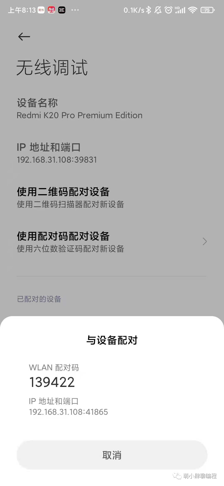

# 无线 ADB 调试连接指南

[English Version](./wirelessDebug_en.md)

> 通过 WiFi 无线连接手机，无需数据线即可使用 BATTClaw 控制你的安卓设备。

---

## 前提条件

- 手机已开启 **开发者选项** 和 **USB 调试**
- 电脑已安装 **ADB** 工具并配置环境变量
- 手机和电脑处于 **同一 WiFi 网络** 下

---

## Android 11+ 原生无线调试（推荐）

Android 11 及以上版本支持**无需数据线**的原生无线调试功能。

### 操作步骤

1. 打开手机 **"设置"** → **"开发者选项"**。

2. 找到并开启 **"无线调试"** 开关，在弹出的确认窗口中点击 **"允许"**。

3. 点击进入 **"无线调试"** 详情页，选择 **"使用配对码配对设备"**，屏幕会显示 **配对码** 和 **IP 地址与端口号**。

4. 在电脑终端执行 `adb pair <手机显示的IP:端口>`，输入手机上的 6 位配对码完成配对。

5. 配对成功后，返回 **"无线调试"** 主页，查看 **"IP 地址和端口"**（注意：此端口与配对端口不同），在终端执行 `adb connect <IP:端口>` 完成连接。

6. 执行 `adb devices` 验证，能看到设备即连接成功。

    

> [!TIP]
> 配对只需执行**一次**，后续只要手机和电脑在同一网络下，开启无线调试后直接 `adb connect` 即可。

---

## Android 11 以下：通过 USB 转无线

适用于不支持原生无线调试的旧版 Android 机型。

1. 先用 **USB 数据线** 连接手机和电脑，确认 `adb devices` 能看到设备。

2. 在终端执行 `adb tcpip 5555`，将 ADB 切换到无线模式。

3. 查看手机 IP 地址：**"设置"** → **"WLAN"** → 点击已连接的 WiFi 查看 IP。

4. **拔掉数据线**，执行 `adb connect <手机IP>:5555` 完成无线连接。

5. 执行 `adb devices` 验证连接。

> [!IMPORTANT]
> 每次手机重启后需要重新用 USB 执行一次 `adb tcpip 5555` 才能恢复无线连接。

---

## 常见问题

| 问题 | 解决方法 |
|------|----------|
| 连接超时 / unable to connect | 确认手机和电脑在**同一 WiFi**，检查路由器是否开启了 AP 隔离 |
| 连接频繁断开 | 在 **"开发者选项"** 中开启 **"始终保持 WLAN 连接"**，靠近路由器使用 |
| 无线比 USB 慢吗？ | BATTClaw 的截图和指令场景下几乎无感知，只有传输大文件时略慢 |

---

## 连接成功后

无线连接建立后，正常启动 BATTClaw 即可，系统会自动识别无线设备，使用体验与 USB 完全一致 🎉
