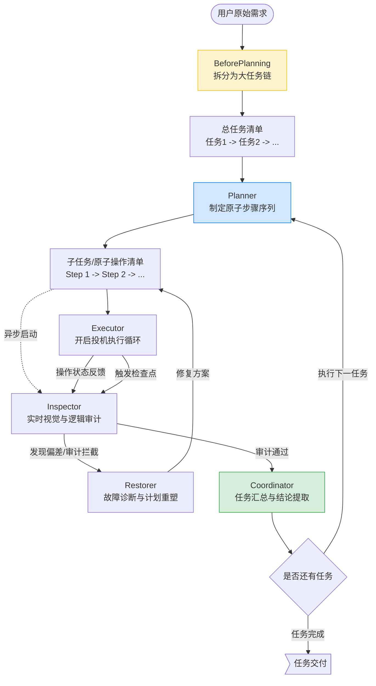

# BATTCLAW 设计文档 & 架构说明

[English Version](./design_en.md)

> **"技术应服务于人的效率，而非服务平台的日活。"** —— BATTClaw 核心理念

---

## 1. 项目结构 (Project Structure)

```text
server/
├── prompt/                    # 原始提示词资产 (Open Source)
│   └── android_role/          # 各 AI 角色的 System Prompts (.md)
├── src/
│   ├── index.ts               # CLI 主入口
│   ├── api/                   # API 接口层
│   ├── modules/
│   │   ├── CLI/               # 命令行交互界面
│   │   ├── agent/             # AI Agent 核心（角色分发、提示词管理）
│   │   │   ├── adb/           # ADB 底层封装与视觉工具
│   │   │   ├── role/          # 核心角色实现（Planner, Executor, Inspector...）
│   │   │   └── stream_parser.ts # 流式响应解析器
│   │   ├── devices/           # 设备管理与连接池
│   │   ├── mcp/               # MCP 协议服务层
│   │   ├── setting/           # 配置管理
│   │   └── stateManager/      # 任务与状态管理
│   └── utils/                 # 日志、代理等工具函数
├── data/                      # 运行时数据（配置、日志）
├── docs/                      # 文档与静态资源
├── start-battclaw.sh          # MCP 启动脚本
└── package.json
```

---

## 2. 核心架构设计 (Core Architecture)

BATTClaw 采用 **多角色协同驱动** 架构，将复杂的长链路任务拆解为四个核心角色的博弈与协作：

### 2.1 角色定义与分工 (Role Specification)

| 角色 | 核心职责 | 技术关键点 |
| :--- | :--- | :--- |
| **BeforePlanning (预处理)** | **意图预拆分**。将用户多项目复杂的复合需求优化拆解为多个相互独立的子任务。 | 需求过滤、纠错与跨 App 任务流切割。 |
| **Planner (规划者)** | **原子化子规划**。针对单一子任务，拆解为 `Level 1~3` 的原子操作序列。 | 动态任务栈管理，支持任务插入与回溯。 |
| **Executor (执行者)** | **子任务执行**。基于截图视觉分析，调用 ADB 工具执行具体动作。 | **视觉语义映射**：像素坐标归一化 (1000x1000)。 |
| **Inspector (检查员)** | **实时审计**。异步校验动作结果，防止 Agent 产生视觉幻觉。 | **投机执行拦截**：发现任务偏离时立即叫停。 |
| **Restorer (修补者)** | **故障自愈**。处理执行卡死、报错，进行“计划重组”。 | **自愈逻辑**：自动诊断故障原因并给出修复方案。 |
| **Coordinator (统筹者)** | **逻辑闭环**。汇总单步任务结果，判定目标是否达成，并驱动任务链流转。 | 数据清洗、结果归约与多任务衔接。 |

### 2.2 任务执行工作流

BATTClaw 采用双层循环架构，确保了从“宏观目标”到“微观动作”的精准受控：



---

## 4. 提示词工程 (Prompt Engineering)

BATTClaw 的灵魂在于其高度优化的提示词矩阵。我们将提示词按照功能解耦，存储于 `prompt/android_role/` 目录下，实现了逻辑与代码的彻底分离：

### 4.1 核心提示词
| 文件名 | 对应角色 | 设计精髓 |
| :--- | :--- | :--- |
| `beforePlanning.md` | **BeforePlanning** | **意图预拆解**：在进入实际规划前清洗用户需求，拆解出多条独立的子任务流，防止大模型在超长程任务中发生“目标遗忘”。 |
| `planner.md` | **Planner** | **自完备子任务**：强制要求每个子任务必须具备“环境锚点”和“预期终态”，确保执行过程不依赖模糊的上下文。 |
| `run_main.md` | **Executor** | **视觉纠偏逻辑**：引入“红点反馈”机制，根据上一轮点击的物理落点自动修正坐标偏移；包含“XML 辅助决策”的触发阈值。 |
| `run_tools.md` | **Executor** | **函数调用规范**：对 `click`、`swipe` 等 ADB 操作进行了严苛的物理限制说明（如点击几何中心点）。 |
| `restorer.md` | **Restorer** | **修复/重塑工作流**：专门处理验证码拦截、App 更新弹窗等异常场景的计划重组逻辑。 |
| `inspector.md` | **Inspector** | **任务审计**：定义了“视觉一致性”和“数据真实性”的双重审查标准，防止 AI 为了完成任务而进行“虚假报备”。 |
| `plan_setStep.md` | **Configurator** | **动态角色指派、任务限制与上下文注入**：评估原子任务难度并动态分配底层执行角色。针对高难度操作（如复杂属性配置、长列表查找）会向 Agent 注入极其严苛的上下文边界与终态确认限制。 |

### 4.2 视觉引导技术
*   **Grid 坐标系**：将不同分辨率的安卓屏幕统一映射为 `1000x1000` 的逻辑坐标系，极大降低了模型对分辨率的认知成本。
*   **思考链 (CoT)**：通过强制输出 `<think>` 标签，引导模型在执行动作前进行“当前状态 -> 障碍分析 -> 行动意图”的深度推理。

---

## 5. 开放资产说明 (Open Assets)

为了践行完全开源的承诺，BATTClaw 开放了所有的核心生产力资产：
*   **源代码**：基于 TypeScript 的全量业务逻辑。
*   **原始提示词**：位于 `prompt/` 目录，包含所有角色的 System Prompt，允许社区进行二次微调与优化。
*   **文档体系**：包含完整的部署教程、架构设计说明。

---

## 6. 调试与日志 (Debugging & Logs)

### 6.1 环境变量开关
> BATTClaw 提供了多维度的可观测性支持，可通过修改 `.env` 环境变量文件进行精细化控制：
*   **SHOWTHINK=true**: 开启模型思考链。在控制台实时观察 AI 的“状态分析 -> 行动意图 -> 决策理由”。
*   **DEBUG=true**: 开启底层调试日志。输出 ADB 原始指令与通信细节，用于排查设备连接与坐标偏移。

### 6.2 核心日志文件 (`log/`)
系统运行产生的文件将被持久化存储在 `log/` 目录下（启动后生成），各角色日志解耦，便于快速排障：

| 日志文件 | 记录内容 | 适用场景 / 排查对象 |
| :--- | :--- | :--- |
| 🔴 **`error.log`** | 全局异常与报错 | 遇到程序崩溃、连不上手机、API 欠费/超时等致命错误时优先查看。 |
| 🔵 **`log.log`** | 全流程日志 | 排查常规启动、网络请求、设备连接状态等基础流程问题。 |
| 🟢 **`aiStdout.log`** | AI 原生输出流 | 记录执行大模型返回的历史对话记录 `<think>` 与 JSON。 |

---

## 7. 未来规划 (Roadmap)

BATTClaw 的征途不仅限于单机自动化，我们的愿景是构建一个跨平台的智能数字中枢：

### 7.1 近期目标：性能与规模化
*   **虚拟机矩阵方案**：目前已完成初步开发，正处于**深度优化与调试阶段**。该方案将支持多安卓模拟器的并行任务分发与同步执行。
*   **本地模型适配优化**：持续优化在低功耗环境下（如本地闲置手机运行大模型）的推理速度及精确度。

### 7.2 远期构想：多端一体化 Agent
*   **跨端协同架构**：我们计划将 BATTClaw 的逻辑引擎迁移至电脑端，打造 **PC 端 Agent**。
*   **多端联动**：实现“手机+电脑”多端一体化的智能助理项目。

---

> **对项目感兴趣？**
> 如果您有任何想法、建议或商业合作意向，欢迎在 [README - 联系我们](../../README.md#contact) 中找到我的联系方式，期待与您的交流！

