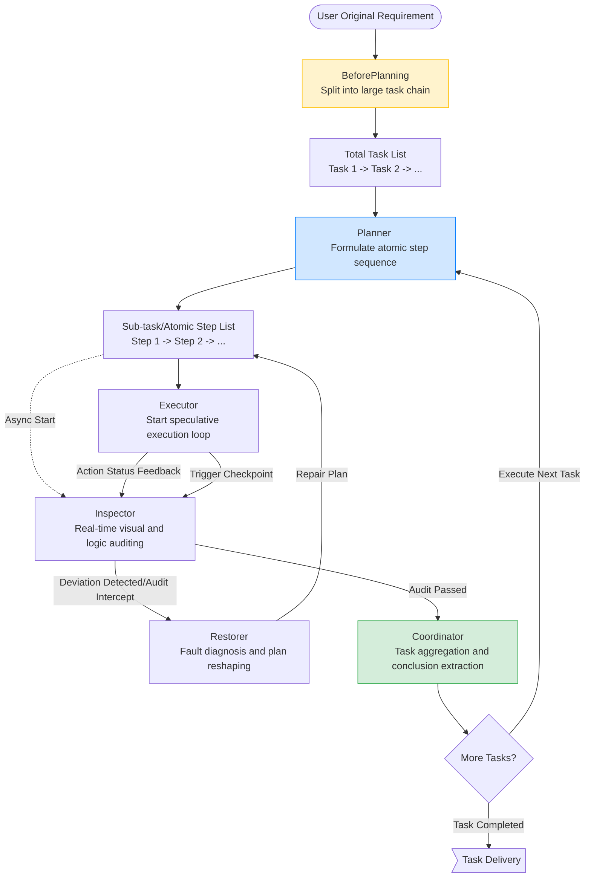

# BATTClaw Architecture Design & Implementation Guide

[中文版本](./design.md) | *English document translated by AI*

> "The elegance of a complex system lies in its deconstruction and control of uncertainty."
>
> This document details the core architectural design philosophy, multi-role collaborative workflow, and best practices in prompt engineering of BATTClaw, aiming to help developers deeply understand its underlying logic and conduct secondary development.

---

## 1. Directory Structure

BATTClaw adopts a highly modular Domain-Driven Design (DDD), with the core logic concentrated in the `server/` directory:

```text
android_Agent/server/
├── prompt/                  # Core Asset: Prompt engineering directory
│   └── android_role/        # Role prompt system exclusive to Android Agent
│       ├── run_main.md      # Executor prompt
│       ├── planner.md       # Planner prompt
│       ├── inspector.md     # Inspector prompt
│       ├── restorer.md      # Restorer prompt
│       └── run_tools.md     # Function call format specification
├── src/
│   └── modules/
│       ├── agent/           # Agent core logic layer
│       │   ├── agent_index.class.ts  # Agent's brain hub and context manager
│       │   └── role/                 # Role strategy and state flow engine
│       │       ├── planner.ts        # Task planning and distribution logic
│       │       ├── executor.ts       # Task speculative execution loop
│       │       ├── inspector.ts      # Visual and logical dual auditing
│       │       └── restorer.ts       # Fault recovery and self-healing logic
│       ├── mcp/             # MCP Protocol adapter layer (Model Context Protocol)
│       └── adb/             # Physical layer communication (ADB driver engine)
└── docs/                    # Project documentation directory
```

---

## 2. Core Architecture Design

BATTClaw adopts a **Multi-Role Orchestration** architecture, breaking down complex long-chain tasks into the game and collaboration of four core roles:

### 2.1 Role Specification

| Role | Core Responsibility | Technical Focus |
| :--- | :--- | :--- |
| **BeforePlanning** | **Intent Pre-splitting**. Optimizes and breaks down complex, multi-item user requirements into multiple independent sub-tasks. | Requirement filtering, error correction, and cross-app task flow slicing. |
| **Planner** | **Atomic Sub-planning**. Breaks down a single sub-task into an atomic operation sequence of `Level 1~3`. | Dynamic task stack management, supporting task insertion and backtracking. |
| **Executor** | **Sub-task Execution**. Calls ADB tools to execute specific actions based on visual analysis of screenshots. | **Visual Semantic Mapping**: Pixel coordinate normalization (1000x1000). |
| **Inspector** | **Real-time Auditing**. Asynchronously verifies action results to prevent Agent visual hallucinations. | **Speculative Execution Interception**: Immediately halts when task deviation is detected. |
| **Restorer** | **Fault Self-healing**. Handles execution freezes and errors, and performs "plan reorganization". | **Self-healing Logic**: Automatically diagnoses failure causes and provides repair plans. |
| **Coordinator** | **Logic Closed-loop**. Aggregates single-step task results, determines if the goal is achieved, and drives the task chain forward. | Data cleaning, result reduction, and multi-task articulation. |

### 2.2 Task Execution Workflow

BATTClaw adopts a double-layer loop architecture, ensuring precise control from "macro goals" to "micro actions":



---

## 3. Prompt Engineering

The soul of BATTClaw lies in its highly optimized prompt matrix. We decoupled the prompts according to their functions and stored them in the `prompt/android_role/` directory, achieving complete separation of logic and code:

### 3.1 Core Prompt Matrix
| File Name | Corresponding Role | Design Essence |
| :--- | :--- | :--- |
| `beforePlanning.md` | **BeforePlanning** | **Intent Pre-splitting**: Cleans up user requirements before entering actual planning, breaking them down into multiple independent sub-task flows to prevent the LLM from suffering "goal amnesia" during ultra-long tasks. |
| `planner.md` | **Planner** | **Self-contained Sub-tasks**: Strictly requires each sub-task to have an "environmental anchor" and an "expected final state", ensuring the execution process does not rely on vague context. |
| `run_main.md` | **Executor** | **Visual Correction Logic**: Introduces a "red-dot feedback" mechanism to automatically correct coordinate offsets based on the physical landing point of the previous click; includes trigger thresholds for "XML-assisted decision making". |
| `run_tools.md` | **Executor** | **Function Call Specification**: Provides strict physical limitation instructions for ADB operations like `click` and `swipe` (e.g., clicking the geometric center point). |
| `restorer.md` | **Restorer** | **Repair/Reshape Workflow**: Specifically handles plan reorganization logic for abnormal scenarios like captcha interception and App update pop-ups. |
| `inspector.md` | **Inspector** | **Task Auditing**: Defines dual review standards for "visual consistency" and "data authenticity" to prevent AI from "falsely reporting" just to complete a task. |
| `plan_setStep.md` | **Configurator** | **Dynamic Role Assignment, Task Limitation & Context Injection**: Evaluates atomic task difficulty and dynamically assigns underlying execution roles. For high-difficulty operations (like complex property configurations or long list searches), it injects extremely strict context boundaries and final-state confirmation limits into the Agent. |

### 3.2 Visual Guidance Technology
*   **Grid Coordinate System**: Uniformly maps Android screens of different resolutions into a `1000x1000` logical coordinate system, significantly reducing the model's cognitive cost for resolution.
*   **Chain of Thought (CoT)**: Guides the model to conduct deep reasoning of "current state -> obstacle analysis -> action intent" before executing an action by forcing the output of `<think>` tags.

---

## 4. Open Assets

To fulfill the promise of complete open source, BATTClaw has opened all core productivity assets:
*   **Source Code**: Full business logic based on TypeScript.
*   **Original Prompts**: Located in the `prompt/` directory, containing the System Prompts for all roles, allowing the community to fine-tune and optimize them.
*   **Documentation System**: Includes complete deployment tutorials and architecture design explanations.

---

## 5. Debugging & Logs

### 5.1 Environment Variable Switches
> BATTClaw provides multi-dimensional observability support, which can be finely controlled by modifying the `.env` environment variable file:
*   **SHOWTHINK=true**: Enables the model's chain of thought. Observe the AI's "state analysis -> action intent -> decision reason" in real-time in the console.
*   **DEBUG=true**: Enables underlying debugging logs. Outputs raw ADB commands and communication details for troubleshooting device connections and coordinate offsets.

### 5.2 Core Log Files (`log/`)
Files generated during system operation will be persistently stored in the `log/` directory (generated after startup), with role logs decoupled for quick troubleshooting:

| Log File | Recorded Content | Applicable Scenario / Target |
| :--- | :--- | :--- |
| **`error.log`** | Global exceptions and errors | Prioritize checking when encountering fatal errors like program crashes, unable to connect to phone, or API arrears/timeouts. |
| **`log.log`** | Core system workflow | Troubleshoot basic process issues like routine startup, network requests, and device connection status. |
| **`aiStdout.log`** | AI native output stream | Records the history of dialogue `<think>` and JSON returned by the executing LLM. |

### 5.3 Troubleshooting Quick Guide
1.  **Cannot run at all?** 👉 Check `.env` and view `error.log` for authentication failures or proxy errors.
2.  **AI clicking randomly on screen?** 👉 Check the coordinate data in `aiStdout.log` to confirm if there's a screenshot resolution mapping anomaly.
3.  **Stuck in an infinite repair loop?** 👉 Jointly diagnose using `inspector.log` (reason for interception) and `aiStdout.log` (AI's persistence).

---

## 6. Roadmap

BATTClaw's journey is not limited to single-device automation; our vision is to build a cross-platform intelligent digital hub:

### 6.1 Short-term Goal: Performance & Scalability
*   **Virtual Machine Matrix Solution**: Initial development is complete and is currently in the **deep optimization and debugging phase**. This solution will support parallel task distribution and synchronous execution across multiple Android emulators.
*   **Local Model Adaptation Optimization**: Continuously optimize inference speed and accuracy in low-power environments (such as running large models on idle local phones).

### 6.2 Long-term Vision: Multi-device Integrated Agent
*   **Cross-device Collaborative Architecture**: We plan to migrate BATTClaw's logic engine to the computer, building a **PC Agent**.
*   **Multi-device Linkage**: Realize a "Mobile + PC" multi-device integrated smart assistant project. At that time, users can use unified commands to drive the Agent to seamlessly transfer data and perform collaborative operations between computer office software and mobile Apps.

---

> **Interested in the project?**
> If you have any thoughts, suggestions, or business cooperation intentions, please find my contact information in the [README - Contact Us](../../README_en.md#contact) and I look forward to communicating with you!
